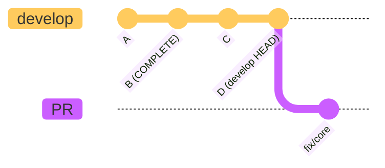

# Deferred Pipelines

## Overview

We defer the GitLab CI pipelines for your PR if it is based on a commit of
`develop` that is newer than what has already been tested by GitLab.

## Background

Spack is fortunate to have a large community of developers (like you!) and our
development velocity is often quite high. Depending on what changes have been
made to Spack recently, our GitLab CI pipelines can sometimes take hours to
complete. For these reasons, we cannot feasibly run GitLab CI pipelines for
every commit of `develop`.

A key component of our GitLab CI pipeline infrastructure is the
[_sync script_](https://github.com/spack/spack-infrastructure/blob/main/images/gh-gl-sync/SpackCIBridge.py).
This runs as a cron job, copying PR branches from GitHub to GitLab where they
are subjected to CI pipeline testing. The sync script also copies the current
`HEAD` commit of `develop` to GitLab whenever it notices that there is no
`develop` pipeline currently running.

## Motivation

As a `develop` pipeline runs, it builds packages and uploads them to Spack's
public binary mirror. These prebuilt binary packages get reused by subsequent
pipelines, reducing the total amount of work that our CI system needs to do.

If we allow PR branches to "outrun" the latest tested commit of develop, they
end up building packages that will also be built by a later `develop` pipeline.
This wastes time and resources performing unnecessary work.

In the figure above, the PR is based off `develop` `HEAD` (commit `D`). If we
started a GitLab CI pipeline for this PR, it would redundantly build any
packages that were changed in commit `C` on develop. To solve this problem, we
defer pushing this PR to GitLab until a `develop` pipeline has completed for
commit `D` or one of its descendants.

## How it Works

For any given PR branch:
* Get the most recent commit of develop that was tested by GitLab (`latest-tested-develop`).
* Run `git merge-base <pr-branch> develop` to find the merge base between this PR and develop (`merge-base-sha`).
* Run `git merge-base --is-ancestor <merge-base-sha> <latest-tested-develop>` to determine if this PR's merge base with develop is an ancestor of `latest-tested-develop`.
  * If it is, merge this PR branch with `latest-tested-develop` and push it to GitLab for testing
  * If not, post a status to the `HEAD` commit for this PR on GitHub indicating why the GitLab CI pipelines are not running yet.

## Tips

After you open a PR, avoid merging or rebasing your branch with `develop`
unless you really need to pull in these newer changes. Rebasing or merging
develop into your PR branch is likely to cause your GitLab CI pipelines
to be deferred for a longer period of time.
