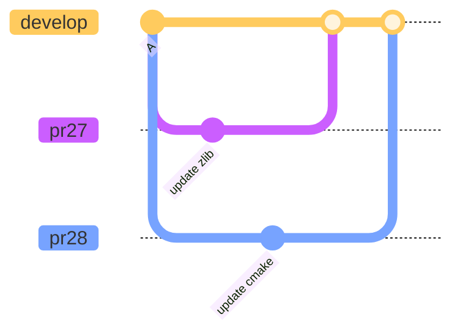
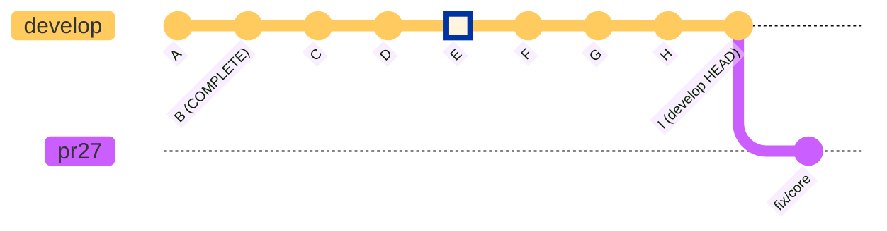
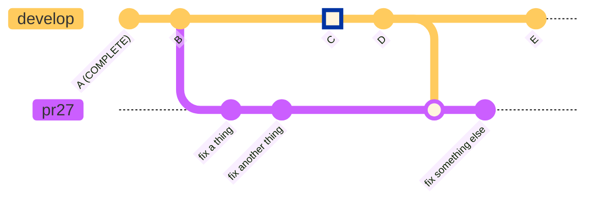

# Gitlab Testing Workflow

This document describes the workflow used to push branches from GitHub to
GitLab, run pipelines, and report status.

Let's follow some diagramming conventions:

- Develop commit associated with the currently GitLab pipeline (if there
is one) is rendering using `type: HIGHLIGHT` so it stands out in the git
graph.
- Develop commit associate with the latest completed GitLab pipeline
includes `COMPLETE` in its label.

## GitHub PR Branch scenarios

## Problems to solve

### Hashes appearing for the first time on develop

This situation arises because changes in PRs don't combine together until they
reach `develop`, and then only one at a time.  Even if both PR branches
are tested with the same `develop`, because they're not tested together, the
new hashes don't appear until the second PR branch is merged.

Using GitHub merge queue feature is promising to resolve this problem.  However, using
merge queue introduces other challenges.

### PR pipelines building new develop hashes not yet in mirror

This problem is caused by the lag between new changes getting merged to `develop`
and those changes getting built in a pipeline and pushed to the mirror.  The
amount it happens correlates with how far the commit associated with the latest
*completed* `develop` pipeline is behind the tip of `develop`.

In the figure below, the PR is merged with the tip of `develop`.  When the
pipeline runs, it will find it needs to build any hashes introduced in commits
`C` through `I` on `develop`.  Some of those hashes are likely getting built
in the running `develop` pipeline associated with `E`, but jobs will be
generated for those hashes anyway, since anything already built isn't yet
indexed.

### Repeated merge develop

In the following scenario a user pushes their PR branch, based on a develop
which is behind the currently running develop, but then before that pipeline
finishes, choose to merge `develop` into their PR branch.

