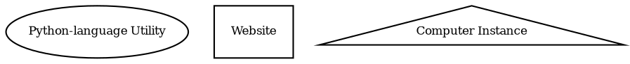
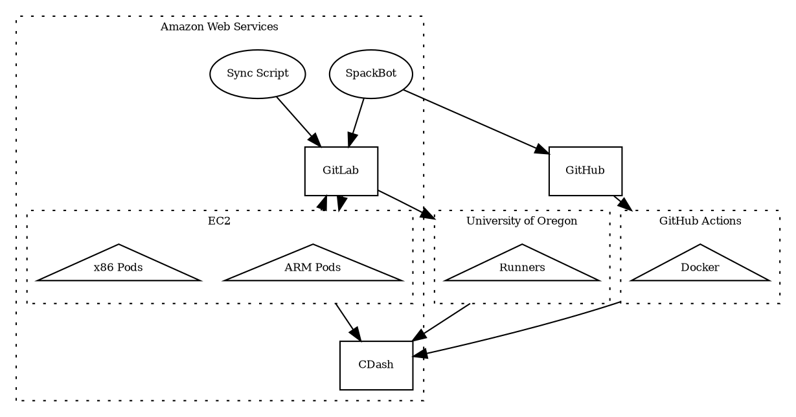

#SPACK Infrastructure

This repository contains the information to set up the SPACK serves that exist
within the Kubernetes instance which is hosted in Amazon Web Services.  The
three main instances are for instances of GitLab and CDash and the hosting of
spack.io.  These directories contain the text files which are used to set up
the Helm package management system for Kubernetes. For more information on how
to use Helm, see the [Helm Documentation](https://helm.sh/docs/intro/using_helm/)


##Shape Legend



##Spackbot

Spackbot is a GitHub service account which is able to execute certain tasks.
```dot
digraph g {
fontsize=8
  compound=true;
  splines=ortho
  edge[fontsize=8]
  node[fontsize=8]
    subgraph cluster_com {
      label="Commands";
      graph[style=dotted];
      subgraph cluster_ci {
        label="Execute CI/CD Pipeline";
        graph[style=dotted];
        pipline[label="spackbot [re-]run pipeline"];
        pipeline[label="spackbot [re-]build pipeline"];
      };
      subgraph cluster_review {
        label="Inform Reviewers";
        graph[style=dotted];
        maintainers[label="spackbot maintainers"];
        review[label="spackbot request review"];
      };
      subgraph cluster_style {
        label="Attempt Style Fix";
        graph[style=dotted];
        style[label="spackbot fix style"];
      };
    };
  };
```
For additional information on Spackbot, see the [online documentation](https://spack.github.io/spackbot/docs/#/)

##Sync Script

```dot
digraph g {
fontsize=8
  compound=true;
  splines=polyline
  edge[fontsize=8]
  node[fontsize=8]
  rank=same
  rankdir=LR

    github->sync->gitlab[color=white, weight=100]
    github[label="GitHub",shape=rectangle]
    gitlab[label="GitLab",shape=rectangle]
    sync[label="SPACK Sync Script"]

    sync->gitlab[label="Updates Pull Request branch"];
    sync->github[label="Polls for develop branch changes"];
    gitlab->github[label="Returns CI/CD Results"];
};
```

The Sync Script is another long-running Python language process in the SPACK network
infrastructure.  This process has one directive: to mirror and update the branches
found on the GitHub instance to the GitLab instance running in AWS.

##GitHub

```dot
digraph g {
fontsize=8
  compound=true;
  splines=ortho
  edge[fontsize=8]
  node[fontsize=8]
  rank=same
  rankdir=LR


  github[label="GitHub",shape=rectangle]
  Docker[shape=triangle]

  SpackBot

  SpackBot->github[eight=100, label="Listens for Comments"]
  github->Docker[label="Executes GitHub Actions tasks"]

};
```
  GitHub is the main location of the SPACK repository.  It also contains the
  actions that are run as the CI/CD Pipeline for each and every pull request.

##GitLab

```dot
digraph g {
  fontsize=8
  compound=true;
  splines=polyline
  edge[fontsize=8]
  node[fontsize=8]
  rank=same
  rankdir=LR
  sync -> gitlab -> gitlabrunner[color=white, weight=10]
  gitlab[label="GitLab",shape=rectangle]
  sync[label="SPACK Sync Script"]
  subgraph cluster_AWS {
    label="Amazon AWS"
    graph[style=dotted];
    gitlabrunner[label="GitLab Runners",shape=triangle]
  };
  gitlabrunner->gitlab[rhead=cluster_AWS,label="Returns CI/CD Results"];
  gitlab->gitlabrunner[lhead=cluster_AWS, label="Executes CI/CD tasks"]

  sync->gitlab[label="Updates Pull Request branch"];

};
```
  SPACK's GitLab instance can be found at
  [gitlab.spack.io](https://gitlab.spack.io).  The GitLab instance is used to
  distribute the longer running tasks via the GitLab Runner capability.  The
  runners for these software "stacks" can be found at the University of Oregon
  and in the Amazon AWS Cloud.

###Infrastructure
  The [k8s/gitlab](https://github.com/spack/spackbot/tree/k8s/gitlab) folder
  contains the files needed to set up a GitLab instance in a Kubernetes cluster
  using a [Helm Releases](https://helm.sh/).

  For more information on the process of setting up and configuring this section
  of the cluster see: [GitLab in Kubernetes](kubernetes.md#gitlab)

##AWS
  The AWS section of the CI infrastructure contains a Kubernetes instance which
  allows for the on-demand creation of testing instances.  These instances are
  split between ARM and x86_64 and each has a variety of sizes.  The instance size
  that is used is determined by the tag given to the job in the GitLab CI YAML
  file.

  The AWS instance also hosts the GitLab and CDash instances for SPACK in
  addition to the instances where both Spackbot and the Sync Script are hosted.


###
  The [k8s](https://github.com/spack/spack-infrastructure/tree/k8s) folder
  contains the files needed to set up the entirety of the infrastructure that
  SPACK hosts in the AWS environment.  

  For more information on the process of setting up and configuring this section
  of the cluster see: [SPACK in AWS](aws.md)

##CDash
All available test results for the CI pipelines can be found on the
[CDash website](https://cdash.spack.io/index.php?project=Spack).
