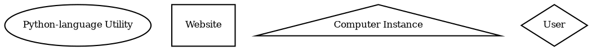

#Pipeline Life Cycle

This document will describe the steps that a pull request will go through, once
it enters the SPACK CI/CD infrastructure.  This page assumes that you have a
branch on a forked version of the GitHub SPACK repository,

##Shape Legend


1. Create the Pull Request
    ```dot
    digraph g {
      compound=true;
      subgraph cluster_gh {
        label="GitHub"
        graph[style=dotted];
        pullRequest[label="Pull Request"];
      }

      developer[label="SPACK Developer", shape="diamond"]
      developer->pullRequest[lhead=cluster_gh, label="Generates Pull Request"];
    }
    ```
    * Your Action

        Select the branch that you wish to merge and use GitHub's capability to
        create a new pull request which will be merged in to the `development`
        branch.

2. Automatic SPACK CI/CD testing
      ```dot
      digraph g {
        compound=true;
        subgraph cluster_gh {
          label="GitHub"
          graph[style=dotted];
          pullRequest[label="Pull Request"];  
        }
        subgraph cluster_AWS {
          label="Amazon Web Services";
          graph[style=dotted];
          SpackBot;
          GitLab[shape=rectangle];
          sync[label="Sync Script"]

      }
      developer[label="SPACK Developer", shape="diamond"]
      pullRequest->GitLab[ltail=cluster_gh, label="Pushes Jobs via GitHub Actions", constraint=false]
      developer->pullRequest[lhead=cluster_gh, label="Comments commands for Spackbot"];
      edge[samehead=h1, label="Pushes Jobs via GitLab CI/CD"];
      SpackBot->pullRequest[lhead=cluster_gh, label="Listens for Comments"];
      sync->pullRequest[lhead=cluster_gh, label="Polls for work/Pushes status", constraint=false];
      sync->GitLab[label="Pushes PR branches / Kicks off CI/CD jobs"]
      }
      ```
     * SPACK Capabilities

         Once the pull request is created, a series of automated steps will kick
         off, following the recipe found in the `.github/Workflows` directory in
         the SPACK repository.  These steps will run the unit, style, and
         installation tests on a variety of environments.  There will also be
         code coverage reports both on an overall basis and on the coverage of
         the code updated in the merge request.

         The GitHub tasks are run on Docker containers.

         The workflow will also kick off a pipeline on the SPACK GitLab
         instance, [gitlab.spack.io](https://gitlab.spack.io).  This pipeline
         will concretize and build the environment for specific "stacks" of
         software.  The SPACK files needed to set up these stacks can be found
         in the `./share/spack/gitlab/cloud_piplines` folders.

         The GitLab tasks are run using a group of GitLab CI Runners.  Some of
         these runners are hosted in participating universities. Others are
         hosted as Amazon EC2 instances.  These instances are of a variety of
         sizes and architectures.  The method of targeting and utilizing a
         specific size of runner will be discussed later.

     The status of these workflow steps will all be reported to the pull
     request page.  

3. Respond to CI results

    ```dot
    digraph g {
      compound=true;
      subgraph cluster_gh {
        label="GitHub"
        graph[style=dotted];
        pullRequest[label="Pull Request"];  
      }
      subgraph cluster_AWS {
        label="Amazon Web Services";
        graph[style=dotted];
        SpackBot;
        GitLab[shape=rectangle];
        sync[label="Sync Script"]

    }
    developer[label="SPACK Developer", shape="diamond"]
    developer->developer[label="Development Iterations"];
    pullRequest->GitLab[ltail=cluster_gh, label="Pushes Jobs via GitHub Actions", constraint=false]
    developer->pullRequest[lhead=cluster_gh, label="Pushes updates to branch / Comments commands for Spackbot"];
    edge[samehead=h1, label="Pushes Jobs via GitLab CI/CD"];
    SpackBot->pullRequest[lhead=cluster_gh, label="Listens for Comments"];
    sync->pullRequest[lhead=cluster_gh, label="Polls for work/Pushes status", constraint=false];
    sync->GitLab[label="Pushes PR branches / Kicks off CI/CD jobs"]
    }
    ```
    * Test Failures are reported

        Once the CI results have all been posted to the pull request page,
        iterations of development may be necessary to get the CI jobs to pass
        completely.


        * SPACK Capabilities

            SPACK has a few automated processes which are running at this step.  The
            first, as mentioned above, is [Spackbot](https://github.com/spack/spackbot).
            This service account listens to the comments of pull requests for command
            which start with the string `@spackbot`.

            Another automated process that comes into play at this point is the Sync
            Script.  This process runs every three minutes and compares the status of
            the merge branch and the `development` branch.  If the branches have been
            updated, the changes from GitHub are pushed to the equivalent branch on
            GitLab.  The Sync Script is also responsible for returning the status of
            the testing which is being performed on the

        * Your Steps:

            If any of the CI failures are fixable with code updates, perform the
            necessary modifications to the code and push a new version.  This can be
            an additional commit or a force-pushed version of the original commit.
            This will start the CI tasks again.

            If the failed tests are as a result of code style issues, Spackbot, via
            the comment of `spackbot fix style`, one can kick off an automated
            process to attempt to fix found style errors. If allowed to create new
            commits on the merge branch and the errors are fixable, this commit will
            push a new commit to the branch with the necessary fixes.  

            *  If the errors are fixable but the push is unsuccessful, check that the
               `Allow edits and access to secrets by maintainers` option has been
               selected for the pull request.

            If the failures are due to a timeout or some other transient error, you
            have the option to re-run the testing to see if the error reappears.
            Commenting `spackbot run pipeline` or  `spackbot re-run pipeline` will
            kick off the CI again without needing to re-base or create an additional
            commit.


     * All tests pass
         ```dot
         digraph g {
           compound=true;
           subgraph cluster_gh {
             label="GitHub"
             graph[style=dotted];
             pullRequest[label="Pull Request"];
           }
           subgraph cluster_AWS {
             label="Amazon Web Services";
             graph[style=dotted];
             SpackBot;
             GitLab[shape=rectangle];
             sync[label="Sync Script"]

         }
         maintainer[label="SPACK Maintainer", shape="diamond"]
         developer[label="SPACK Developer", shape="diamond"]
         maintainer->pullRequest[lhead=cluster_gh, label="Approves and Merges Pull Request"];
         developer->pullRequest[lhead=cluster_gh, label="Requests Reviewer"];
         spackbot->pullRequest[lhead=cluster_gh, label="Listens for reviewer requests / Polls packages for maintainer lists"];
         sync->pullRequest[lhead=cluster_gh, label="Polls for status changes", constraint=false];
         sync->GitLab[label="Closes mirrored Merge Request and deletes branch (if needed)" ]
         }
         ```
         Once the CI steps all pass, now you are ready for a reviewer.

         * Your steps:

             * Ask SpackBot for a reviewer:

                 In addition to triggering pipelines, SpackBot can assign a reviewer via
                 comment. `spackbot request review` or `spackbot maintainers` will assign
                 a SPACK developer or notify the maintainers of the package that may be
                 changed as part of the merge request.

4. Celebrate!
